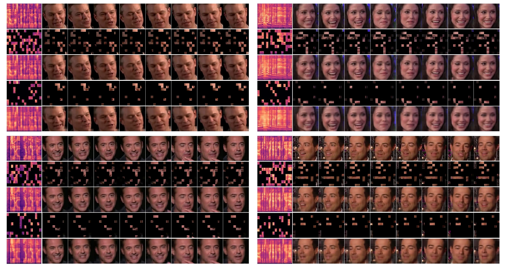

# HiCMAE: Hierarchical Contrastive Masked Autoencoder for Self-Supervised Audio-Visual Emotion Recognition

> [[arXiv]](https://arxiv.org/abs/2401.05698) <br>
> [Licai Sun](https://sunlicai.github.io/), [Zheng Lian](https://scholar.google.com/citations?user=S34nWz0AAAAJ&hl=en), [Bin Liu](https://scholar.google.com/citations?user=UEB_5QEAAAAJ&hl=en), and [Jianhua Tao](https://scholar.google.com/citations?user=781jbHMAAAAJ&hl=en)<br>
> University of Chinese Academy of Sciences & Institute of Automation, Chinese Academy of Sciences & Tsinghua University<br>

## 📰 News
**[2024.01.11]** We upload the initial code and pre-trained model. 


## ✨ Overview


Abstract:
Audio-Visual Emotion Recognition (AVER) has garnered increasing attention in recent years for its critical role in creating emotion-ware 
intelligent machines. Previous efforts in this area are dominated by the supervised learning paradigm. Despite significant
progress, supervised learning is meeting its bottleneck due to the longstanding data scarcity issue in AVER. Motivated by recent advances 
in self-supervised learning, we propose Hierarchical Contrastive Masked Autoencoder (HiCMAE), a novel self-supervised
framework that leverages large-scale self-supervised pre-training on vast unlabeled audio-visual data to promote the advancement
of AVER. Following prior arts in self-supervised audio-visual representation learning, HiCMAE adopts two primary forms of self-supervision 
for pre-training, namely masked data modeling and contrastive learning. Unlike them which focus exclusively on top-layer representations 
while neglecting explicit guidance of intermediate layers, HiCMAE develops a *three-pronged* strategy to foster *hierarchical* audio-visual 
feature learning and improve the overall quality of learned representations. Firstly, it incorporates *hierarchical skip connections* between 
the encoder and decoder to encourage intermediate layers to learn more meaningful representations and bolster masked audio-visual reconstruction. 
Secondly, *hierarchical cross-modal contrastive learning* is also exerted on intermediate representations to narrow the audio-visual 
modality gap progressively and facilitate subsequent cross-modal fusion. Finally, during downstream fine-tuning, HiCMAE employs 
*hierarchical feature fusion* to comprehensively integrate multi-level features from different layers. To verify the effectiveness 
of HiCMAE, we conduct extensive experiments on 9 datasets covering both categorical and dimensional AVER tasks. Experimental results 
show that our method significantly outperforms state-of-the-art supervised and self-supervised audio-visual methods, which indicates that 
**HiCMAE is a powerful audio-visual emotion representation learner**.


## 🚀 Main Results

<p align="center">
   <br>
   Comparison with state-of-the-art audio-visual methods on 9 datasets.
</p>

Please check our arXiv paper to see detailed results on each dataset.


## 👀 Visualization

### ✨ Reconstruction 



Please check our arXiv paper to see details better.

### ✨ t-SNE on CREMA-D


## 🔨 Installation

Main prerequisites:

* `Python 3.8`
* `PyTorch 1.10.1 (cuda 11.3), torchvision==0.11.2, torchaudio==0.10.1`
* `timm==0.4.12`
* `einops==0.6.1`
* `decord==0.6.0`
* `openmim==0.3.6, mmcv==1.7.1`
* `scikit-learn=1.2.1, scipy=1.10.0, pandas==1.5.3, numpy=1.23.5`
* `opencv-python=4.7.0.72`
* `tensorboardX=2.6.1`
* `soundfile==0.12.1`

If some are missing, please refer to [requirements.txt](requirements.txt) for more details.


## ➡️ Data Preparation

1. If the original dataset does not provide extracted faces, we use [OpenFace](https://github.com/TadasBaltrusaitis/OpenFace) to extract them from videos. Please see [extract_face.py](preprocess/face_and_audio/extract_face.py) in [preprocess](preprocess) for details.

2. If the original dataset does not provide extracted audios (sampling rate: 16k), we use FFmpeg to extract them from videos. Please see [extract_audio.py](preprocess/face_and_audio/extract_audio.py) in [preprocess](preprocess) for details.

3. Follow the files (e.g., [cremad_av.py](preprocess/creamd_av.py)) in [preprocess](preprocess) to prepare your annotation files.

    Specifically, you need to enerate annotations for dataloader ("<path_to_video> <path_to_audio> <class_idx>" in annotations). 
The annotation usually includes `train.csv` and `test.csv`. The format of `*.csv` file is typically like this:

    ```
    dataset_root/video_1 dataset_root/audio_1 label_1
    dataset_root/video_2 dataset_root/audio_2 label_2
    dataset_root/video_3 dataset_root/audio_3 label_3
    ...
    dataset_root/video_N dataset_root/audio_N label_N
    ```

    An example of [train.csv](saved/data/crema-d/audio_visual/split01/train.csv) for CREMA-D (6-class) fold1 (fd1) is shown as follows:

    ```
    /data/ycs/AC/Dataset/CREMA-D/face_aligned/1019_DFA_ANG_XX /data/ycs/AC/Dataset/CREMA-D/AudioWAV/1019_DFA_ANG_XX.wav 0
    /data/ycs/AC/Dataset/CREMA-D/face_aligned/1019_DFA_DIS_XX /data/ycs/AC/Dataset/CREMA-D/AudioWAV/1019_DFA_DIS_XX.wav 1
    /data/ycs/AC/Dataset/CREMA-D/face_aligned/1019_DFA_FEA_XX /data/ycs/AC/Dataset/CREMA-D/AudioWAV/1019_DFA_FEA_XX.wav 2
    ```

## 📍Pre-trained Model

Download the model pre-trained on VoxCeleb2 from [this link](https://drive.google.com/file/d/1mR2r-_LWmtTYl4pS_L3YlhKNCCnv_ZaE/view?usp=sharing) and put it into [this folder](saved/model/pretraining/voxceleb2/audio_visual/hicmae_pretrain_base).

## ⤴️ Fine-tuning with pre-trained models

- CREMA-D

    ```
    sh scripts/voxceleb2/audio_visual/hicmae_pretrain_base/cream-d/finetune_170.sh
    ```
  
- MAFW

    ```
    sh scripts/voxceleb2/audio_visual/hicmae_pretrain_base/mafw/finetune_170.sh
    ```
    

## ☎️ Contact 

If you have any questions, please feel free to reach me out at `sunlicai2019@ia.ac.cn`.

## 👍 Acknowledgements

This project is built upon [VideoMAE](https://github.com/MCG-NJU/VideoMAE) and [AudioMAE](https://github.com/facebookresearch/AudioMAE). Thanks for their great codebase.

## ✏️ Citation

If you think this project is helpful, please feel free to leave a star⭐️ and cite our paper:

```
@article{sun2024hicmae,
  title={HiCMAE: Hierarchical Contrastive Masked Autoencoder for Self-Supervised Audio-Visual Emotion Recognition},
  author={Sun, Licai and Lian, Zheng and Liu, Bin and Tao, Jianhua},
  journal={arXiv preprint arXiv:2401.05698},
  year={2024}
}
```

